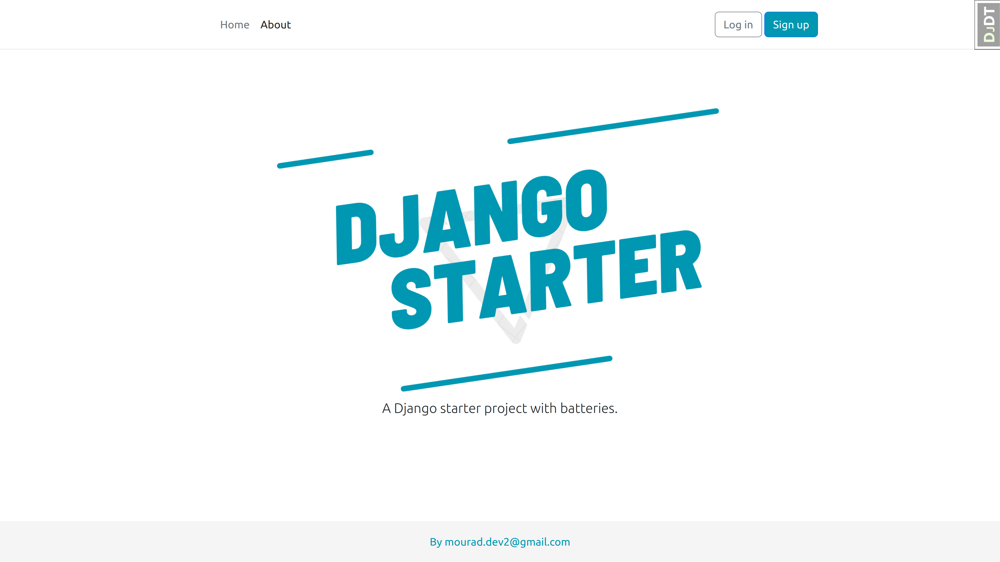

> A Django starter project. 


## Features :point_down: :point_down: :point_down:

- Django 4.2 & Python 3.11
- Install via [Pip](https://pypi.org/project/pip/) 
- User log in/out, sign up, password reset via [django-allauth](https://github.com/pennersr/django-allauth)
- Static files configured with [Whitenoise](http://whitenoise.evans.io/en/stable/index.html)
- Styling with [Bootstrap v5](https://getbootstrap.com/)
- Debugging with [django-debug-toolbar](https://github.com/jazzband/django-debug-toolbar)
- DRY forms with [django-crispy-forms](https://github.com/django-crispy-forms/django-crispy-forms)
- Custom 404, 500, and 403 error pages
----

## Table of Contents
* **[Installation](#installation)**
  * [Pip](#pip)
* [Next Steps](#next-steps)
* [Contributing](#contributing)
* [Support](#support)
* [License](#license)

----

## 📖 Installation
Django staret can be installed via Pip. 
To start, clone the repo to your local computer and change into the proper directory.

```
$ git clone https://github.com/Mouradev2/django-starter.git
$ cd django_starter
```

### Pip

```
$ python -m venv .venv

# Windows
$ Set-ExecutionPolicy -ExecutionPolicy RemoteSigned -Scope CurrentUser
$ .venv\Scripts\Activate.ps1

# macOS or linux
$ source .venv/bin/activate

(.venv) $ pip install -r requirements.txt
(.venv) $ python manage.py migrate
(.venv) $ python manage.py createsuperuser
(.venv) $ python manage.py runserver
# On your web browser open this url http://127.0.0.1:8000
```


## Next Steps

- Add environment variables. There are multiple packages but I personally prefer [environs](https://pypi.org/project/environs/).
- Add [gunicorn](https://pypi.org/project/gunicorn/) as the production web server.
- Update the [EMAIL_BACKEND](https://docs.djangoproject.com/en/4.0/topics/email/#module-django.core.mail) and connect with a mail provider.
- Make the [admin more secure](https://opensource.com/article/18/1/10-tips-making-django-admin-more-secure).
- `django-allauth` supports [social authentication](https://django-allauth.readthedocs.io/en/latest/providers.html) if you need that.

----

## 🤝 Contributing

Contributions, issues and feature requests are welcome! See [CONTRIBUTING.md](https://github.com/Mouradev2/django-starter/blob/main/CONTRIBUTING.md).

## ⭐️ Support

Give a ⭐️  if you find this project helpfull!

## License

[The MIT License](LICENSE)

## 💥 Other Django project source codes
Feel free to visit my github repository [title](https://github.com/Mouradev2).
You may find your next django project inspiration 💡 , source codes for multiples types of projects are availables!
